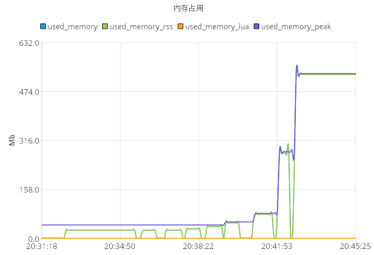

# 操作结果

| 请求个数               |value大小               |set 执行速度每秒        |get 执行速度每秒        |内存大小                |
| ----------------------| ---------------------- |---------------------- |---------------------- |---------------------- |
| 300000      | 10       |372208.44|455235.22|26.49M|
| 300000      | 20       |372670.81|462249.63|30.45M|
| 300000      | 50       |350467.28|436046.50|38.40M|
| 300000      | 100       |345622.13|429184.56|50.24M|
| 300000      | 200       |302114.81|422535.22|77.95M|
| 300000      | 1000       |86132.64|292968.75|276.54|
| 300000      | 2000       |44033.46|177935.94|529.21M|


## redis info
#### redis-version 3.2.100
#### os windows
#### arch_bits 64 
#### hz 10
#### redis-desktop0.9.3.817

# 操作过程
```
redis-cli flushall
redis-benchmark -r 1000000 -n 300000 -d 10 -t set,get -P 16 -q
```
#### SET: 372208.44 requests per second
#### GET: 455235.22 requests per second
#### 已使用内存26.49M

```
redis-cli flushall
redis-benchmark -r 1000000 -n 300000 -d 20 -t set,get -P 16 -q
```
#### SET: 372670.81 requests per second
#### GET: 462249.63 requests per second
#### 已使用内存30.45M

```
redis-cli flushall
redis-benchmark -r 1000000 -n 300000 -d 50 -t set,get -P 16 -q
```
#### SET: 350467.28 requests per second
#### GET: 436046.50 requests per second
#### 已使用内存38.40M

```
redis-cli flushall
redis-benchmark -r 1000000 -n 300000 -d 100 -t set,get -P 16 -q
```
#### SET: 345622.13 requests per second
#### GET: 429184.56 requests per second
#### 已使用内存50.24M
```
redis-cli flushall
redis-benchmark -r 1000000 -n 300000 -d 200 -t set,get -P 16 -q
```
#### SET: 302114.81 requests per second
#### GET: 422535.22 requests per second
#### 已使用内存77.95M

```
redis-cli flushall
redis-benchmark -r 1000000 -n 300000 -d 1000 -t set,get -P 16 -q
```
#### SET: 86132.64 requests per second
#### GET: 292968.75 requests per second
#### 已使用内存276.54M

```
redis-cli flushall
redis-benchmark -r 1000000 -n 300000 -d 2000 -t set,get -P 16 -q
```
#### SET: 44033.46 requests per second
#### GET: 177935.94 requests per second
#### 已使用内存529.21M


----------------------------------------------------------
----------------------------------------------------------


# 内存分析

key为12位数字 保存8byte

RedisObject key类型为原始数字类型时8位 string封装类型16位

实际每个key为16byte 其中8位的对象信息 8位值大小

实际每个value为16+size(value) byte 其中16位对象信息 size(value) 为值保存的大小

保存key的hash表本身也要使用24个byte内存，再由于内存分配器的原因实际要占用32byte


操作内存占用过程

